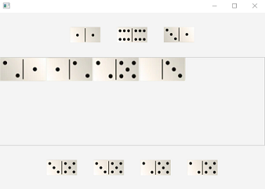
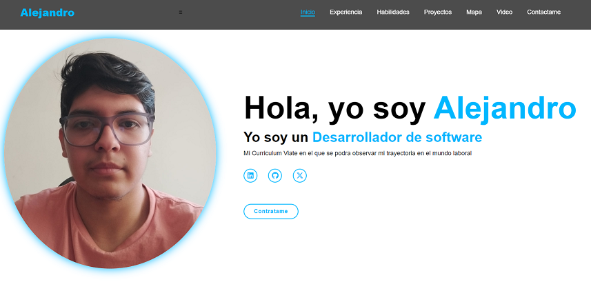

# Mi sitio personal
     
>Este es mi sitio personal. Aquí puedes encontrar información sobre mí, mis proyectos y mis intereses.
     
## Contenido
   
>* [Información personal](#información-personal)
>* [Proyectos](#proyectos)
>* [Tecnologías del curso](#tecnologías-del-curso)
   
## Información personal
     
>* Nombre: Alejandro Diez
>* Ocupación: Estudiante
>* Lugar de residencia: Ecuador
>* Sitio web: [Curriculum Vitae](https://alexdiez10.github.io/Curriculum-Vitae/)
## Proyectos
      
>### Domino
>
     
>**¿De que trata el proyecto**
>Consiste en una versión simplificada del tradicional juego de Domino, en este juego el objetivo es ganarle a la computadora, quedándote sin fichas o evitando que la computadora pueda seguir jugando.
      
>**Tecnologías usadas**
>>* Java
>>* Javafx

>**Link del repositorio**
>[Domino](https://github.com/AlexDiez10/Domino.git)
       
>### BSCARS
>
       
>**¿De que trata el proyecto?**
>Trata de una aplicación de compra y venta de vehículos, el cual soporta a su vez distintos tipos de transportes, desde carros normales, eléctricos y de lujo; hasta aviones, barcos, etc.
       
>**Tecnologías usadas**
>>* Java
>>* Javafx
       
>**Link del repositorio**
>[BSCARS](https://github.com/AlexDiez10/Domino.git)
        
>### QuestionGame
>
      
>**¿De que trata el proyecto**
>Un juego en el que por medio de la serie de preguntas la máquina adivina el animal (en un futuro habrá más categorías) en el que estás pensando, tú eliges la cantidad de preguntas que te puede hacer la máquina.
      
>**Tecnologías usadas**
>>* Java
>>* Javafx
      
>**Link del repositorio**
>[QuestionGame](https://github.com/Kenkyo1/ED_P1_Grupo05_P2.git)

>### Curriculum Vitae
>
     
>**¿De que trata el proyecto**
>Es mi curriculum vitae en el que se puede ver más proyectos (en un futuro), más sobre mí, mis habilidades y tecnologías que domino. Además de una forma de tener contacto conmigo en caso de querer realizar un proyecto.
     
>**Tecnologías usadas**
>>* HTML
>>* CSS
     
>**Link del repositorio**
>[Curriculum-Vitae](https://github.com/AlexDiez10/Curriculum-Vitae.git)
      
## Tecnologías del curso
> ### Lenguajes de programación
>>* Javascript: Permite crear páginas web interactivas y dinámicas.
>>* Typescript: Es un superconjunto de JavaScript que añade tipado estático.
>>* Python: Ideal para backend y servicios API.

> ### Lenguaje de etiquetas y hojas de estilos
>>* HTML: Define la estructura y contenido de una página web.
>>* CSS: Controla el aspecto visual de los elementos HTML.

> ### Frameworks y Librerías
>>* React: Desarrollo de aplicaciones web de una sola página (SPA).

> ### Herramientas
>>* Git: Es un sistema de control de versiones distribuido.
>>* GitHub: Es una plataforma de alojamiento de código basada en Git.
